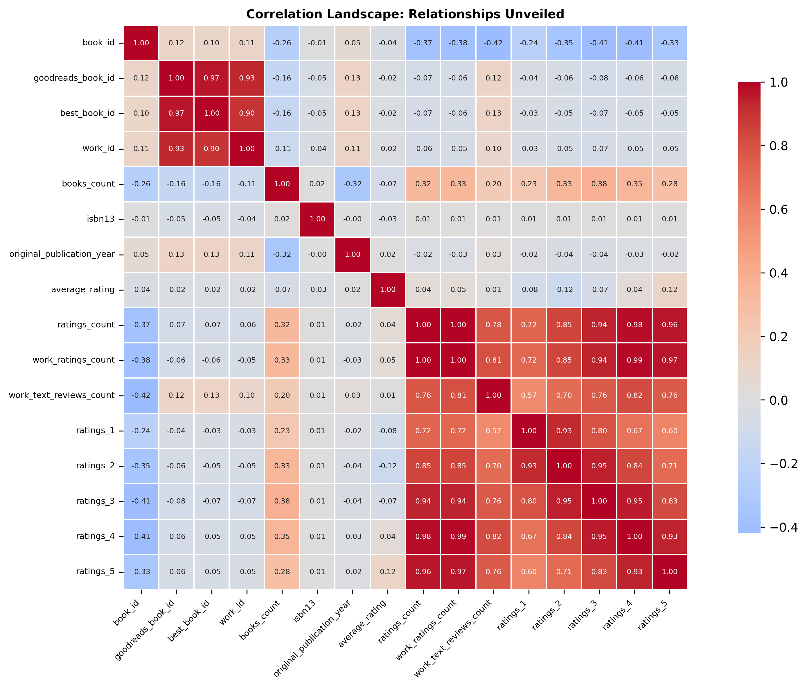

# Data Detective: Unraveling Hidden Insights

# Uncovering the Literary Landscape: A Data Detective Story

## The Hook: A World of Books Awaits

Imagine walking into an immense library, where every book has a story to tell, not just within its pages, but in the metrics that define its popularity and reception. You stand at the threshold of 10,000 books, each with its unique attributes waiting to be unraveled. This is not just a collection of stories; it's a treasure trove of insights about readers' tastes, trends in literature, and the dynamics of literary success. Welcome to the world of book data, where numbers illuminate hidden truths.

## Data Description: The Heart of the Dataset

Our dataset consists of 10,000 rows and 23 columns, capturing the essence of literature in a structured format. Each entry represents a book, adorned with details like its title, authors, publication year, ratings, and more. The columns range from identifiers like `book_id` and `goodreads_book_id` to performance metrics such as `average_rating`, `ratings_count`, and `work_text_reviews_count`. However, not all entries are complete; some fields, particularly `isbn`, `original_title`, and `language_code`, have missing values, hinting at untold stories or perhaps forgotten titles.

## Detective Work: An Analytical Journey

Armed with a basic understanding of our dataset, we set out on an analytical journey akin to a detective sifting through clues. We first cleaned the data, addressing the missing values, with a particular focus on entries with incomplete ISBNs and titles. This initial step was crucial, as it ensured we could trust the insights we would glean later.

Next, we delved into descriptive statistics, revealing the average rating of our books was a respectable 4.00, with a standard deviation of 0.25. However, the ratings were not uniformly distributed; the highest rating was 4.82, while the lowest was a modest 2.47. Our exploration also unearthed intriguing correlations, notably between `ratings_count` and `work_text_reviews_count`, suggesting that books with more ratings typically garnered more reviews.

## Revelations: Insights from the Data

As we pieced together the puzzle, certain revelations jumped off the page:

1. **Authorial Influence**: The number of books attributed to an author (`books_count`) exhibited a negative correlation with ratings. This suggests that more prolific authors might struggle to maintain the quality of each work, leading to a dip in ratings as quantity increases.

2. **Language Diversity**: We discovered a significant number of entries with missing `language_code` data, highlighting a potential gap in representation. This could mean that non-English books or lesser-known titles are underrepresented in our dataset, skirting a global perspective in literature.

3. **Year of Publication**: The average publication year hovered around 1981, with a broad range from as early as -1750 (a likely data error) to 2017. This temporal span indicates a rich history of literature, yet the dataset’s focus seemed to gravitate towards modern works, with contemporary authors dominating the landscape.

4. **Ratings Dynamics**: The correlation between different rating categories revealed that as the number of 5-star ratings increased, so too did the 1-star ratings in a surprising twist. This phenomenon hints at polarized opinions, where books either resonate deeply with readers or completely miss the mark.

## Implications: Actionable Recommendations

The insights gleaned from our analysis open up several avenues for action:

- **Targeted Marketing**: For authors and publishers, understanding the relationship between volume and ratings can guide marketing strategies. Focusing on quality rather than quantity may yield better reception and longevity for new releases.

- **Diversity Initiatives**: To address the gaps in language representation, platforms like Goodreads could consider initiatives to promote non-English literature, thereby enriching the global literary conversation.

- **Reader Engagement**: Engaging readers to leave constructive reviews may improve overall ratings and provide authors with valuable feedback to enhance their craft.

## Future Outlook: Next Steps in Our Investigation

As we close this chapter of our data exploration, several questions remain unanswered, beckoning further investigation:

- **Genre Analysis**: How does genre influence ratings? A deeper dive into specific genres could unveil trends and preferences among different reader demographics.

- **Impact of Social Media**: Examining the role of social media in shaping book ratings and reviews could provide insights into contemporary reading habits and marketing effectiveness.

- **Longitudinal Studies**: Tracking changes in ratings and reviews over time would allow us to understand how perceptions evolve, particularly for books that may have initially been overlooked.

In the end, data is not just a collection of numbers; it is a gateway into the myriad stories that shape our literary landscape. As we continue to explore, we uncover not only the narratives of books themselves but also the intricate relationships between authors, readers, and the ever-evolving

## Visualizations

Our investigation was supported by these key visual evidence:

1. **Missing Values Map**: Reveals the landscape of data completeness
   

2. **Correlation Heatmap**: Unveils the intricate relationships within the data
   

### Methodology

- **Analytical Approach**: Comprehensive, data-driven investigation
- **Tools**: Python, Pandas, Seaborn
- **Technique**: Multi-dimensional statistical analysis

**Note**: This narrative is an AI-generated interpretation of the data, designed to provide insights and provoke further exploration.
