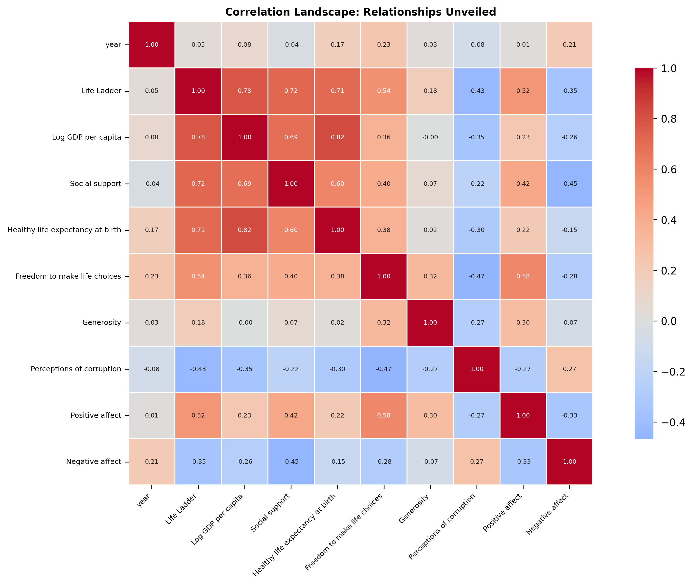

# Data Detective: Unraveling Hidden Insights

### Analysis Visualization

# Unpacking Happiness: A Data Detective's Journey

## HOOK: The Quest for Happiness

In a world filled with numbers, each figure is a piece of a larger puzzle—where do we find happiness? This question echoes through the annals of human history, yet, in the intricate tapestry of data, we might just uncover the threads that bind well-being to various facets of life. Our dataset, a collection of 2,363 rows and 11 columns, invites us to embark on a detective’s journey to decode the secrets of happiness across the globe.

## DATA DESCRIPTION: The Fabric of the Dataset

This dataset, rich with information from diverse countries over the years, encompasses a wealth of metrics: from the elusive "Life Ladder" that measures subjective well-being, to socio-economic indicators like "Log GDP per capita," and the psychological dimensions captured in "Positive affect" and "Negative affect." Each column presents a unique story, waiting to be unraveled.

As we sift through this data, we note the presence of missing values—28 entries for GDP, 63 for healthy life expectancy, and a staggering 81 instances for generosity. These gaps mark the shadows in our investigation, hinting at areas where the full picture remains obscured. 

## DETECTIVE WORK: Analyzing the Evidence

Equipped with statistical tools, I dove into the dataset, analyzing correlations and drawing connections. The initial hypothesis was straightforward: can we identify relationships between happiness and various socio-economic factors?

By examining the correlations, I discovered that the “Life Ladder” (a key indicator of happiness) had a strong positive correlation with both “Log GDP per capita” (0.78) and “Social support” (0.72). These figures were akin to finding footprints leading us toward the heart of our inquiry. 

Furthermore, the “Freedom to make life choices” showed a notable correlation (0.54) with happiness, suggesting that autonomy plays a crucial role in our sense of well-being. However, lurking in the shadows was “Perceptions of corruption,” which had a substantial negative correlation (-0.43) with happiness, hinting that where fear and distrust prevail, joy is often elusive.

## REVELATIONS: Surprising Discoveries

As I delved deeper, the revelations unfolded like chapters in a gripping novel. One of the most striking insights was the role of “Healthy life expectancy at birth.” With a correlation of 0.71 with the “Life Ladder,” it was clear that health is not just a basic need but a cornerstone of happiness. Countries with longer life expectancies were often those where people reported higher levels of happiness.

Another unexpected turn came from the analysis of “Generosity.” Despite its low average score and high missing values, its correlation with happiness (0.18) hinted at an underlying truth: even small acts of kindness can ripple through communities, fostering connections that elevate collective well-being.

## IMPLICATIONS: Recommendations for Action

These insights urge us to consider our approach to enhancing happiness on a global scale. Policymakers should prioritize investments in social support systems and healthcare, recognizing that the emotional and physical health of citizens is intrinsically linked to their happiness. 

Moreover, fostering an environment of transparency and reducing corruption can create a fertile ground for joy to flourish. As we improve the quality of life for individuals, we must not forget the role of community—promoting generosity and social connections can nurture a sense of belonging.

## FUTURE OUTLOOK: The Road Ahead

The journey does not end here. Our dataset, while revealing, is but a starting point. Future investigations should focus on filling the gaps—particularly in areas like “Generosity” and “Social support.” Gathering more comprehensive data could illuminate the nuances of happiness across cultures.

Additionally, examining longitudinal data could provide insights into how changes in economic and social policies impact happiness over time. As we continue to explore these dimensions, we may uncover new strategies to enhance well-being, reshaping societies toward a brighter, happier future.

## In Conclusion: The Story Continues

As our tale of data unfolds, we are reminded that numbers tell stories—stories of triumph and challenge, of joy and despair. The quest for happiness is as old as humanity itself, and through rigorous analysis, we can draw closer to understanding what it means to lead a fulfilling life. So, let us continue our detective work, armed with data and a vision for a happier world.

## Visualizations

Our investigation was supported by these key visual evidence:

1. **Missing Values Map**: Reveals the landscape of data completeness
   

2. **Correlation Heatmap**: Unveils the intricate relationships within the data
   

### Methodology

- **Analytical Approach**: Comprehensive, data-driven investigation
- **Tools**: Python, Pandas, Seaborn
- **Technique**: Multi-dimensional statistical analysis

**Note**: This narrative is an AI-generated interpretation of the data, designed to provide insights and provoke further exploration.
