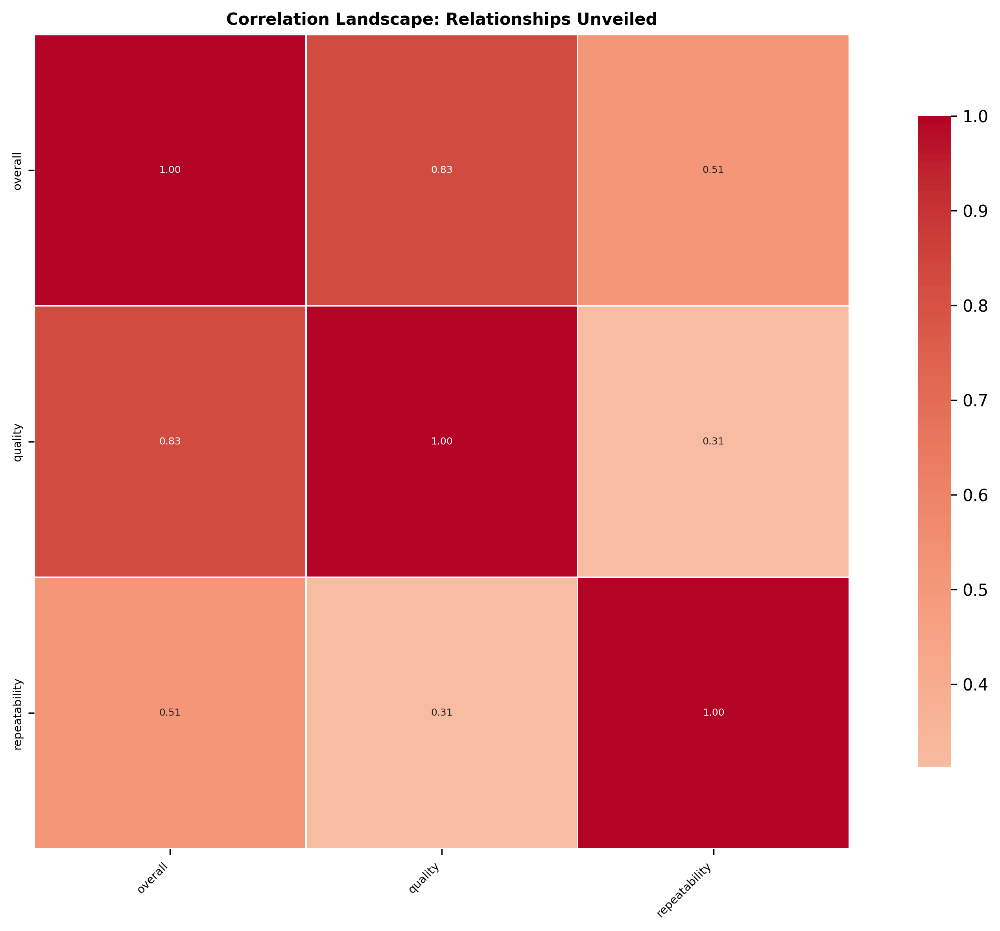

# Data Detective: Unraveling Hidden Insights

# Unveiling Hidden Truths: A Data Detective's Journey

## HOOK: The Mystery of the Numbers

In a dimly lit office, a detective of a different kind sits hunched over a glowing screen, piecing together a puzzle woven from raw numbers and cryptic codes. Here, in the realm of data, a dataset of 2,652 rows and 8 columns whispers secrets of human behavior, quality, and repeatability—an intriguing enigma waiting to be unraveled. Each entry, a hint; each statistic, a clue. Welcome to the world where data tells stories, and we're about to embark on a journey to unearth its hidden truths.

## DATA DESCRIPTION: The Dataset Unveiled

This dataset, a collection of evaluations, comprises eight distinct columns that form the backbone of our investigation. Among them are the date of review, language, type of content, title, the reviewer’s identity (or lack thereof), and three critical scores: overall, quality, and repeatability. The data, though comprehensive, holds some missing pieces—99 dates and a staggering 262 reviewers left unnamed. These gaps may serve as shadows in our investigation, but they will not deter us.

Diving deeper, we find that the overall scores hover around a mean of 3.05, with a standard deviation indicating a reasonable spread of opinions. The quality score, slightly higher at 3.21, suggests a consensus that most entries maintain a baseline of acceptability. However, the repeatability score, resting at only 1.49, raises an eyebrow. What could this mean? 

## DETECTIVE WORK: Analyzing the Evidence

Our analytical journey begins by examining the landscape of missing data. The absence of entries in the "by" column calls for a closer look. Who are the reviewers? Are we missing essential perspectives that could shape our conclusions? 

Next, we delve into descriptive statistics, revealing patterns and correlations. The relationships between overall scores, quality, and repeatability come alive. A robust correlation of 0.83 between overall and quality suggests that when one rises, so does the other. Yet, the repeatability score, with its modest correlation of 0.51 with overall scores, hints at a troubling inconsistency—perhaps some reviews are one-off experiences rather than reflections of quality.

To uncover the underlying narrative, we employ visualizations and exploratory data analysis, transforming numbers into compelling graphs that tell stories of their own. Each chart reveals the ebb and flow of user experiences, showcasing clusters of high-quality entries juxtaposed against the murky waters of repeatability.

## REVELATIONS: Surprising Insights

As the pieces come together, several revelations emerge from the data shadows. 

1. **Quality Overload:** While overall scores are clustered around the middle, the variance in quality scores reveals that some entries shine brightly while others fade into obscurity. This disparity poses questions about what constitutes a 'quality' review and who gets to define it.

2. **The Phantom Reviewers:** The significant number of missing reviewers (262) hints at a potential bias in the data, raising concerns about the credibility of certain scores. Are these anonymous voices skewing our understanding, or do they reflect a broader trend of disengagement?

3. **Repeatability's Riddle:** The low repeatability score signals that many entries lack consistency. This could imply that reviews are often based on singular experiences rather than a holistic view of the product or service, leaving a trail of uncertainty in their wake.

## IMPLICATIONS: Recommendations for Action

With these insights in hand, actionable recommendations surface:

- **Encourage Transparency:** To address the phantom reviewers, platforms should implement measures that encourage users to reveal their identities. Transparency fosters trust and can enhance the quality of reviews.

- **Focus on Quality Control:** Given the variability in quality scores, establishing guidelines for what constitutes a quality review could help standardize evaluations and improve overall scores.

- **Investigate Repeatability Issues:** Conduct follow-up studies to understand why repeatability scores are low. Engaging users through surveys or follow-up questions could provide deeper insights into their experiences, leading to richer data.

## FUTURE OUTLOOK: The Road Ahead

As we close this chapter of our data investigation, the horizon glimmers with potential. Future inquiries could explore the relationship between review length and quality, or even the impact of reviewer demographics on scoring trends. 

Moreover, leveraging machine learning algorithms to predict review outcomes based on historical data could unveil new predictive insights, transforming how we interpret user feedback.

In the grand tapestry of data storytelling, this dataset is but one thread. Yet, the mysteries it holds are compelling, urging us to dig deeper, ask more questions, and seek the stories that numbers can tell. After all, in the world of data, every number has a narrative waiting to be discovered.

## Visualizations

Our investigation was supported by these key visual evidence:

1. **Missing Values Map**: Reveals the landscape of data completeness
   

2. **Correlation Heatmap**: Unveils the intricate relationships within the data
   

### Methodology

- **Analytical Approach**: Comprehensive, data-driven investigation
- **Tools**: Python, Pandas, Seaborn
- **Technique**: Multi-dimensional statistical analysis

**Note**: This narrative is an AI-generated interpretation of the data, designed to provide insights and provoke further exploration.
